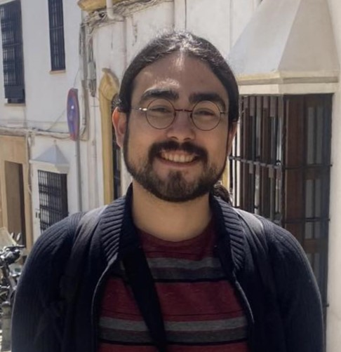

# Hello, and welcome to my research page! 🧙‍♂️

{align="left": style="height:150;width:150px"}

My name is Joël De Leon Mayeu and I am a 1st year physics MSc student at McGill university under the supervision of [Pr. Tami Pereg-Barnea](https://pbtami.wixsite.com/mysite-1). 

My main research interests are the study of condensed matter systems with interesting or exotic topological phases. I've mostly done work on the SSH model ([Su–Schrieffer–Heeger](https://en.wikipedia.org/wiki/Su%E2%80%93Schrieffer%E2%80%93Heeger_model)) and on [Weyl semi-metals](https://en.wikipedia.org/wiki/Weyl_semimetal).

If you're like to learn more about me, you can find an introduction to [my research](./reasearch/index.md), some info on some [recent projects](./projects/index.md) and some more info [about me](./about/index.md).

